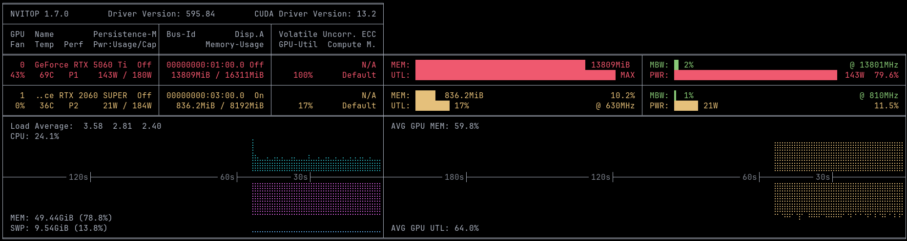

#+title: Custom tools used
* Table of contents :TOC:
- [[#platform-agnostic][Platform agnostic]]
  - [[#gdu][GDU]]
- [[#nixos-linux][NixOS (Linux)]]
  - [[#nvitop][NVITOP]]
  - [[#mediainfo][MEDIAINFO]]
  - [[#exiftool][EXIFTOOL]]
- [[#darwin-macos][Darwin (MacOS)]]

* Platform agnostic

** GDU

  gdu

  Disk usage analyzer with console interface.
  More information: https://github.com/dundee/gdu#usage.

  Interactively show the disk usage of the current directory:

    gdu

  Interactively show the disk usage of a given directory:

    gdu path/to/directory

  Interactively show the disk usage of all mounted disks:

    gdu --show-disks

  Interactively show the disk usage of the current directory but ignore some sub-directories:

    gdu --ignore-dirs path/to/directory1,path/to/directory2,...

  Ignore paths by regex:

    gdu --ignore-dirs-pattern '.*[abc]+'

  Ignore hidden directories:

    gdu --no-hidden

  Only print the result, do not enter interactive mode:

    gdu --non-interactive path/to/directory

  Do not show the progress in non-interactive mode (useful in scripts):

    gdu --no-progress path/to/directory

* NixOS (Linux)

** NVITOP

An interactive NVIDIA-GPU process viewer.
I find it most useful in full mode. It can either be started with =nvitop --monitor full=, or start normally and press =f=  upon opening

#+DOWNLOADED: Example of execution

** MEDIAINFO

  mediainfo

  Display metadata from video and audio files.
  More information: https://mediaarea.net/MediaInfo.

  Display metadata for a given file in the console:

    mediainfo file

  Store the output to a given file along with displaying in the console:

    mediainfo --Logfile=out.txt file

  List metadata attributes that can be extracted:

    mediainfo --Info-Parameters

** EXIFTOOL

  exiftool

  Read and write meta information in files.
  More information: https://exiftool.org/exiftool_pod.html.

  Print the EXIF metadata for a given file:

    exiftool path/to/file

  Remove all EXIF metadata from the given files:

    exiftool -All= path/to/file1 path/to/file2 ...

  Remove GPS EXIF metadata from given image files:

    exiftool "-gps*=" path/to/image1 path/to/image2 ...

  Remove all EXIF metadata from the given image files, then re-add metadata for color and orientation:

    exiftool -All= -tagsfromfile @ -colorspacetags -orientation path/to/image1 path/to/image2 ...

  Move the date at which all photos in a directory were taken 1 hour forward:

    exiftool "-AllDates+=0:0:0 1:0:0" path/to/directory

  Move the date at which all JPEG photos in the current directory were taken 1 day and 2 hours backward:

    exiftool "-AllDates-=0:0:1 2:0:0" -extension jpg

  Only change the DateTimeOriginal field subtracting 1.5 hours, without keeping backups:

    exiftool -DateTimeOriginal-=1.5 -overwrite_original

  Recursively rename all JPEG photos in a directory based on the DateTimeOriginal field:

    exiftool '-filename<DateTimeOriginal' -dateFormat %Y-%m-%d_%H-%M-%S%%lc.%%e path/to/directory -recurse -extension jpg

* Darwin (MacOS)

